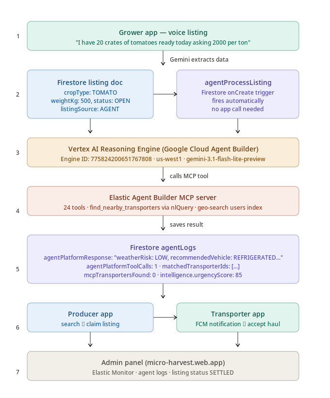

# 🌾 Micro-Harvest
### AI-Powered Agricultural Logistics Platform
**Google Cloud Rapid Agent Hackathon 2026 · Elastic Track**

> Connecting Growers, Producers, and Transporters through conversational AI, real-time geo-matching, and automated payment settlement — built for rural India.

[](https://youtu.be/0ZdplkglDBo)
[](https://micro-harvest.web.app)
[](https://micro-harvest-landing.web.app)
[](LICENSE)

---

## 📺 Demo Video

[](https://youtu.be/0ZdplkglDBo)

> **3-minute walkthrough** — farmer listing via AI agent, offline-first flow, buyer geo-search, driver assignment, gate handover, and Stripe payment settlement.

---

## 🎯 The Problem

**16% of Indian produce — worth ₹92,000 Crore — is lost annually** to supply chain failures. Farmers lack digital market access, buyers can't discover surplus crops in real time, and drivers have no coordination layer.

| Stat | Reality |
|------|---------|
| 58% of farmers | Have no digital market access |
| 3–5 days | Average logistics coordination delay |
| ₹92,000 Cr | Lost annually to produce wastage |
| 100M+ | Indian farmers who need this |

---

## 🔄 System Flow



### How it works

```
Farmer chats with AI Agent
        ↓
Gemini 3.1 Flash extracts crop type, quantity, price, urgency
        ↓
AI Operational Reasoning Engine scores urgency + weather risk
        ↓
Elastic MCP (24 tools) geo-matches nearest buyer + transporter
        ↓
Driver gets FCM push → navigates → Gate 1 pickup → Gate 2 delivery
        ↓
Stripe settles payment: 80% Farmer · 15% Transporter · 5% Platform
```

---

## 📱 Three Apps. One Platform.

| App | Role | Key Features |
|-----|------|-------------|
| **Grower App** | Farmer | AI Harvest Agent chat, offline listing, earnings dashboard |
| **Producer App** | Buyer | Smart surplus search, geo-filtered listings, transport tracking |
| **Transporter App** | Driver | Auto haul assignment, GPS routing, gate handover, instant pay |

### Download APKs

| App | Download |
|-----|----------|
| 🌾 Farmer (Grower) | [grower-release.apk](https://github.com/ssurekumar01111-hue/micro-harvest/releases/download/v1.0.0/grower-release.apk) |
| 🏪 Buyer (Producer) | [producer-release.apk](https://github.com/ssurekumar01111-hue/micro-harvest/releases/download/v1.0.0/producer-release.apk) |
| 🚚 Driver (Transporter) | [transporter-release.apk](https://github.com/ssurekumar01111-hue/micro-harvest/releases/download/v1.0.0/transporter-release.apk) |

> **Note:** Enable "Install from unknown sources" in Android Settings before installing.

---

## 🏗️ Architecture

### Tech Stack

| Layer | Technology | Purpose |
|-------|-----------|---------|
| AI Agent | Google Agent Platform | Orchestrates multi-tool agents |
| LLM | Gemini 3.1 Flash Lite Preview | Harvest intelligence & logistics reasoning |
| Search | Elastic MCP (24 tools) | Semantic crop search + geo-intelligence |
| Backend | Firebase (Firestore, Auth, Functions, Hosting) | Fully serverless |
| Payments | Stripe | Instant farmer settlement on delivery |
| Location | Geo-Intelligence | Radius-based matching + driver routing |
| Frontend | Flutter (Android + Web) | 3 mobile apps + admin panel |

### Agent Configuration

```
AGENT_ID     = 775824200651767808
AGENT_REGION = us-west1
AGENT_PROJECT = micro-harvest
MODEL        = gemini-3.1-flash-lite-preview
```

### Elastic MCP Server — 24 Tools

The Elastic MCP server exposes 24 tools covering:
- Semantic crop listing search with geo-distance queries
- Transporter availability matching by radius
- Listing index health monitoring
- Real-time search profiling and debugging
- BigQuery analytics integration

---

## ✨ Key Features

### 🛰️ Offline-First Listing
Farmers in rural India often have intermittent connectivity. The Harvest Agent detects offline state, queues the conversation locally, and **automatically syncs and publishes the listing the moment internet returns** — zero farmer action needed.

### 🤖 AI Operational Reasoning Engine
Every listing is scored by an AI reasoning engine that evaluates:
- Crop urgency (days until spoilage)
- Weather risk in the farm's region
- Optimal vehicle type for the load
- Recommended price band vs. market average

All reasoning is stored in Firestore and visible in the admin panel.

### 🔍 Smart Surplus Search
Buyers use natural language queries ("20 macro bins of Merlot within 50km") which the Elastic MCP server translates into geo-distance + semantic search queries across the listings index.

### 💳 Automated Payment Settlement
Stripe processes payment on Gate 2 delivery confirmation with an automatic split:
- **80%** → Farmer (same day)
- **15%** → Transporter
- **5%** → Platform fee

---

## 🗂️ Repository Structure

```
micro-harvest/
├── apps/
│   ├── grower/          # Farmer Flutter app (Android)
│   ├── producer/        # Buyer Flutter app (Android)
│   ├── transporter/     # Driver Flutter app (Android)
│   └── admin/           # Flutter Web admin panel
├── functions/
│   └── src/             # Firebase Cloud Functions (TypeScript)
├── micro_harvest_landing/ # Flutter Web landing page
├── firebase.json
├── .firebaserc
└── README.md
```

---

## 🚀 Getting Started

### Prerequisites
- Flutter 3.x
- Firebase CLI
- Node.js 18+
- A Firebase project with Firestore, Auth, and Functions enabled

### Setup

```bash
# Clone the repo
git clone https://github.com/ssurekumar01111-hue/micro-harvest.git
cd micro-harvest

# Install Functions dependencies
cd functions && npm install

# Run any Flutter app
cd apps/grower
flutter pub get
flutter run
```

### Deploy Admin Panel

```bash
cd apps/admin
flutter build web --release
firebase deploy --only hosting:admin
```

### Deploy Landing Page

```bash
cd micro_harvest_landing
flutter build web --release --base-href "/"
firebase deploy --only hosting:landing
```

---

## 🌐 Live Links

| Resource | URL |
|----------|-----|
| 🎬 Demo Video | https://youtu.be/0ZdplkglDBo |
| 🖥️ Admin Panel | https://micro-harvest.web.app |
| 🌐 Landing Page | https://micro-harvest-landing.web.app |
| 📦 GitHub Releases | https://github.com/ssurekumar01111-hue/micro-harvest/releases/tag/v1.0.0 |

---
Demo Credentials:

Email: admin@microharvest.com
Password: Admin@123

These credentials are provided solely for judging and demonstration purposes.

## 👤 Built By

**Surendra Kumar (MorningStar)**
- GitHub: [@ssurekumar01111-hue](https://github.com/ssurekumar01111-hue)
- Portfolio: [portfolio.gfood.in](https://portfolio.gfood.in)

Built for the **Google Cloud Rapid Agent Hackathon 2026 — Elastic Track**

---

## 📄 License

MIT License — see [LICENSE](LICENSE) for details.
